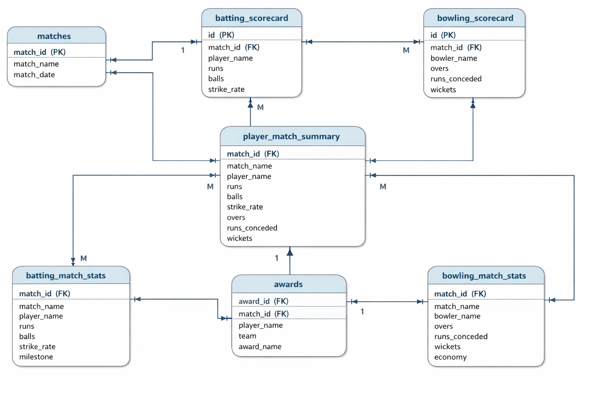

# 🏏 CricBuzz Data Warehousing Project

## 📌 Project Overview
This project is an **end-to-end Cricket Data Warehousing system** built using **Python + SQLite**, inspired by CricBuzz match data.

It follows a **clear ETL pipeline**:
- Raw CSV data (scraped per match)
- Normalized relational database
- Derived summary & analytics tables
- SQL-based insights

 **DBMS / Data Warehousing**.

---

## 🧱 Architecture Overview

```
Raw Match CSVs
     │
     ▼
Python Loaders (ETL)
     │
     ▼
SQLite Data Warehouse
     │
     ▼
Derived Tables & Views
     │
     ▼
SQL Analytics & Insights
```

---

## 🗂️ Folder Structure

```
CricBuzz_Data_Warehousing/
│
├── scraper/
│   ├── db_setup.py
│   ├── load_players.py
│   ├── load_matches.py
│   ├── load_scorecards.py
│   ├── load_match_results.py
│   └── cricket.db
│
├── matches/
│   ├── <match_folder_1>/
│   │   ├── batting_scorecard.csv
│   │   ├── bowling_scorecard.csv
│   │   ├── match_result.csv
│   │   ├── info_segment.csv
│   │   └── playing_11_profiles_detailed.csv
│   └── ...
│
├── README.md
└── .gitignore
```

---

## 🔄 ETL Pipeline (Phase-wise)

### Phase 1: Database Setup
Creates all normalized tables with **PK–FK relationships**.
```bash
python db_setup.py
```

---

### Phase 2: Players Loader
Loads players, teams, roles, and mappings.
```bash
python load_players.py
```

---

### Phase 3: Matches Loader
Loads match metadata:
- Match name
- Date
- Match type (T20 / ODI)
- Venue
- Teams
```bash
python load_matches.py
```

---

### Phase 4: Scorecards Loader
Loads:
- Batting scorecards
- Bowling scorecards
```bash
python load_scorecards.py
```

---

### Phase 5: Derived Tables & Views
Creates analytics-ready tables:
- `batting_summary`
- `bowling_summary`
- `batting_by_match_type`
- `player_batting_milestones`
- `player_of_match_count`

---

### Phase 6: Match Results Loader
Loads:
- Match result
- Player of the Match
- Team scores
```bash
python load_match_results.py
```

---
## data flow chart

## 🧮 Database Schema

### Core Tables
- `teams`
- `players`
- `player_roles`
- `player_role_map`
- `matches`
- `match_results`
- `match_info_raw`
- `batting_scorecard`
- `bowling_scorecard`

---

### 📐 ER Diagram (Schema)

> **⬇️ PLACEHOLDER FOR SCHEMA IMAGE ⬇️**




---

## 📊 Example SQL Insights

### Runs scored by a player in a specific match
```sql
SELECT p.player_name, b.runs
FROM batting_scorecard b
JOIN players p ON b.player_id = p.player_id
JOIN matches m ON b.match_id = m.match_id
WHERE p.player_name LIKE 'Suryakumar Yadav%'
  AND m.match_name LIKE '%1st T20%';
```

---

### Top run scorers
```sql
SELECT player_name, total_runs
FROM player_batting_milestones
ORDER BY total_runs DESC;
```

---

### Player of the Match counts
```sql
SELECT * FROM player_of_match_count;
```

---

## 🚀 Tech Stack
- **Python 3**
- **SQLite**
- **Pandas**
- **SQL**

---

## ✅ Key Highlights
- Fully normalized schema
- Clean PK–FK relationships
- No redundant data
- Real-world cricket analytics
- Git branch-based project management

---

## 👨‍🎓 Academic Use
Perfect for:
- DBMS Project
- Data Warehousing Project
- SQL Analytics Demonstration
- ETL Pipeline Explanation


## 🙌 Team Members
**Raghav Gupta &**
**Shreya Pandey**

---

⭐ *This application is a practical demonstration of Data Warehousing concept.*
