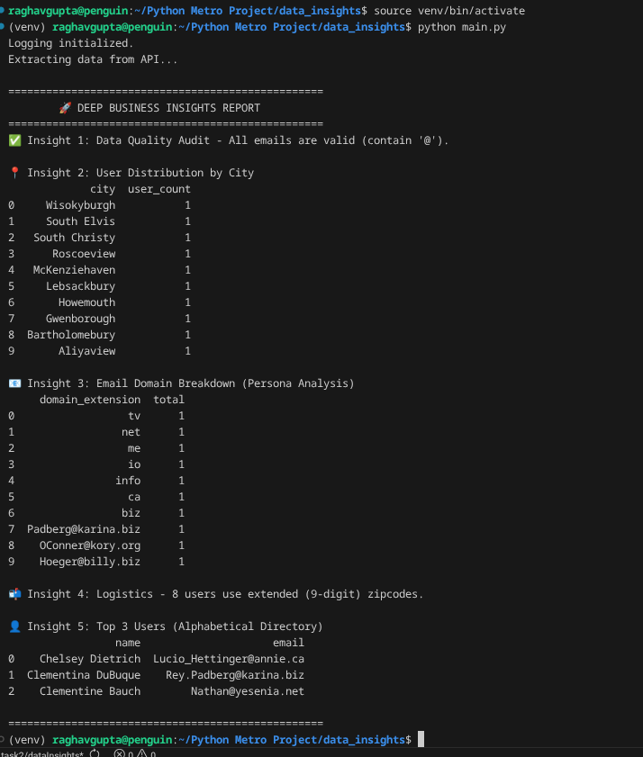

# 📊 User Data ETL Pipeline & Business Insights
**Assignment #2 | Data Engineering Pipeline**

## 📖 Project Overview
This project demonstrates a production-grade **ETL (Extract, Transform, Load)** pipeline built with Python. It automates the process of fetching raw JSON data from a REST API, cleaning it, enforcing strict data quality rules, and storing it in a Relational Database (SQLite) for advanced business analysis.

---

## 🛠️ System Architecture
The pipeline follows a modular architecture to ensure scalability and maintainability:

1.  **Extraction Layer:** Fetches data from `JSONPlaceholder API` with full exception handling.
2.  **Transformation Layer:** * Flattens nested JSON structures (Address/City/Zip).
    * Implements 4-tier data validation logic.
3.  **Loading Layer:** * **Staging:** Saves data to `transformed_data.csv`.
    * **Production:** Loads data into a `SQLite` database.
4.  **Analytics Layer:** Executes SQL queries to generate actionable business insights.


---

## 📂 Project Structure
| File | Purpose |
| :--- | :--- |
| `main.py` | **Orchestrator:** The entry point that runs the entire pipeline. |
| `data_pipeline.py` | **Core Engine:** Contains the logic for ETL and data validation. |
| `config.py` | **Configuration:** Sets up logging to track success and failures. |
| `pipeline.log` | **Audit Trail:** (Generated) Stores execution timestamps and error reports. |
| `transformed_data.csv` | **Flat File:** (Generated) Cleaned data for Excel/Sharing. |
| `business_insights.db` | **Database:** (Generated) The final SQLite relational database. |

---

## ✅ Data Validation Rules
The pipeline enforces the following rules to ensure data quality. Any records failing these are rejected before reaching the database:

| Rule | Action | Implementation Logic |
| :--- | :--- | :--- |
| **Duplicate user_id** | Reject | `drop_duplicates(subset=['user_id'])` |
| **Email Without @** | Reject | Regex/String filtering for '@' presence. |
| **City null** | Reject | Filtering for non-null/non-empty city strings. |
| **Zipcode < 5** | Reject | String length validation (`len >= 5`). |

---

## 🚀 Installation & Usage

### 1. Set Up Environment
It is recommended to use a virtual environment to avoid system conflicts:
```bash
# Create and activate venv
python3 -m venv venv
source venv/bin/activate 

# Install dependencies
pip install requests pandas

run:- main.py

## 🖥️ Execution & Results

### Terminal Output
Below is a screenshot of the pipeline successfully executing the ETL process and displaying the 5 business insights:



### Data Quality Evidence
The screenshot above confirms that the **Data Integrity Audit** passed with 0 invalid records, proving the Python validation logic is effective.


